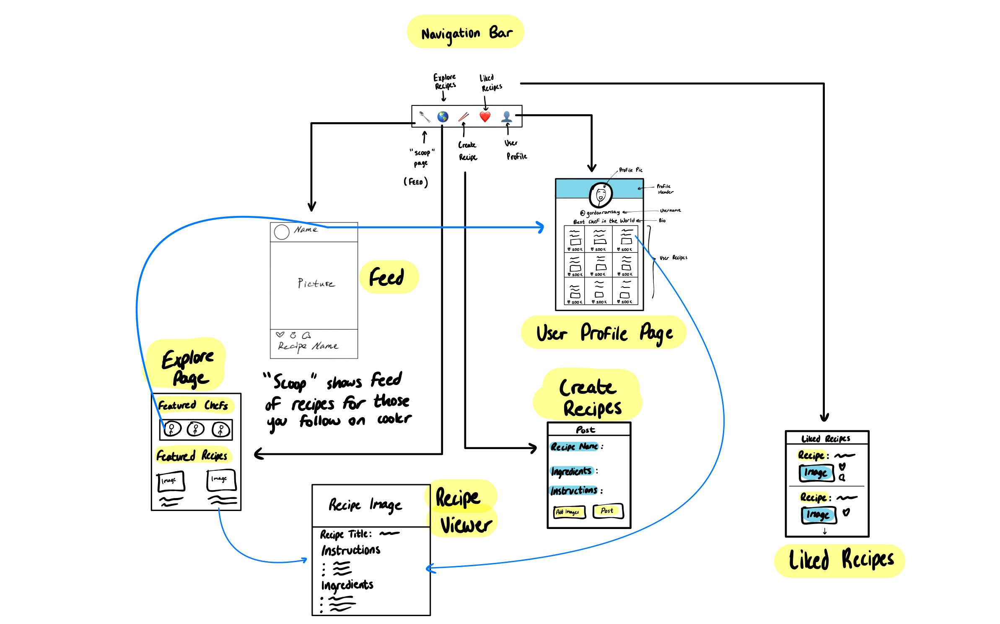

# cookr
cookr is a social media iOS app for sharing recipes with your friends and the world! 🍽 📱

## Table of Contents
1. [Overview](#Overview)
1. [Product Spec](#Product-Spec)
1. [Wireframes](#Wireframes)
2. [Schema](#Schema)

## Overview
### Description
The aim of cookr is to serve as the de-facto social media platform for sharing delicious recipes with the world!
Our users will be able to learn about new cultures by bringing their ideas to the forefront of the dinner table, with the recipes coming right from the palm of their hand.

### App Evaluation
- **Category:** Social Networking / Food
- **Mobile:** The following app will be primarily developed for the iOS App Store. Although this app has intentions to remain as an iOS app, it has the potential to expand into a cross-platform web application as well.
- **Story:** The story we want our users to experience is simple: Hop on cookr, admire the wonderful recipes available on our app, post their own recipes to share with others, and create someone else's recipe right in the comfort of their own kitchen.
- **Market:** Anyone interested in learning to cook and learn about new cultures can use this app.
- **Habit:** This app is something users should look at in their free time before eating a meal. Perhaps by looking at the recipes posted by others, they will be inspired to bring that individual's food to their own dinner table.
- **Scope:** The scope of our app can be expanded such that it serves as both a recipe app and a health app. Users can opt in to weekly cooking competitions while keeping track of the calories they consume per meal. This app can potentially be connected to other apps like "MyFitnessPal" in order to determine the calories for a given recipe. 

## Product Spec

### 1. User Stories (Required and Optional)

**Required Must-have Stories**

* The user shall log in and log out.
* The user shall create an account.
* The user shall see the profile picture of another user.
* The user shall edit their personal information.
* The user shall see the posts from users they are following.
* The user shall see the posts from users they have not followed.
* The user shall search for other users.
* The user shall like posts.
* The user shall see posts they liked.

**Optional Nice-to-have Stories**

* Filter for food types
* Option to determine calories for a given meal using MyFitnessPal
* Ability to post videos and slideshows in addition to written instructions and single images

### 2. Screen Archetypes

* Login
   * Requires log in to the user's account the first time they open this app or after they log out.
* Register
   * To register for an account.
* Post Screen
   * To post a recipe.
* Profile Screen
   * To displaying the profile and posts of another user.
* Settings Screen
   * To edit the user's personal information including the username, password, and profile picture.
* Following Feed Screen
   * To feed posts from the users the user follows.
* Liked Recipes Screen
   * To displaying all posts/recipes they liked.
* Explore Screen
   * To search for users and see recipes from users they have not followed.

### 3. Navigation

**Tab Navigation** (Tab to Screen)

* Following Feed 
* Explore Screen
* Post Screen
* Liked Recipes
* Settings

**Flow Navigation** (Screen to Screen)

* Forced login -> sign up for new account
* Forced login -> feed page
* Sign up -> feed page
* Profile -> text field to modify
* Following feed -> profile page of the users
* Liked recipes -> profile page of the users
* Explore -> profile page of the users

## Wireframes
[Add picture of your hand sketched wireframes in this section]

### [BONUS] Digital Wireframes & Mockups

### [BONUS] Interactive Prototype

## Schema 
### Models
| Property      | Type     | Description |
| ------------- | -------- | ------------|
| postId        | String   | unique id for the user post (default field) |
| author        | Pointer to User| author of the post |
| image         | File     | image that user posts |
| recipeName    | String   | name of the recipe |
| ingredients   | String   | ingredients of the recipe |
| instructions  | String   | instruction of the recipe |
| likesCount    | Number   | number of likes for the post |
| createdAt     | DateTime | date when post is created (default field) |

### Networking
- [Add list of network requests by screen ]
- [Create basic snippets for each Parse network request]
- [OPTIONAL: List endpoints if using existing API such as Yelp]
